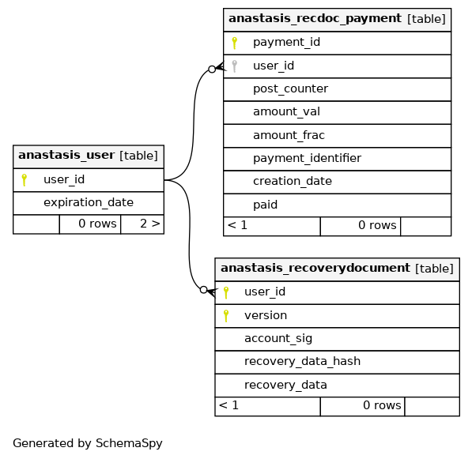
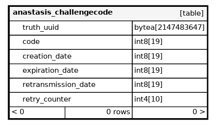
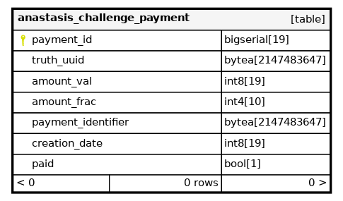
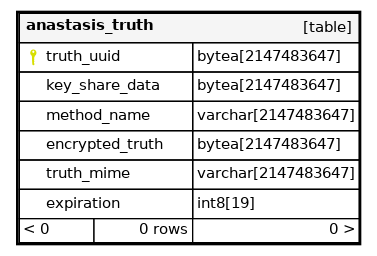
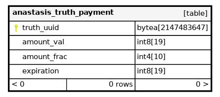

..
  This file is part of Anastasis
  Copyright (C) 2019-2021 Anastasis SARL

  Anastasis is free software; you can redistribute it and/or modify it under the
  terms of the GNU Affero General Public License as published by the Free Software
  Foundation; either version 2.1, or (at your option) any later version.

  Anastasis is distributed in the hope that it will be useful, but WITHOUT ANY
  WARRANTY; without even the implied warranty of MERCHANTABILITY or FITNESS FOR
  A PARTICULAR PURPOSE.  See the GNU Affero General Public License for more details.

  You should have received a copy of the GNU Affero General Public License along with
  Anastasis; see the file COPYING.  If not, see <http://www.gnu.org/licenses/>

  @author Christian Grothoff
  @author Dominik Meister
  @author Dennis Neufeld

---------
DB Schema
---------

