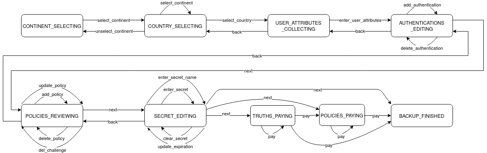
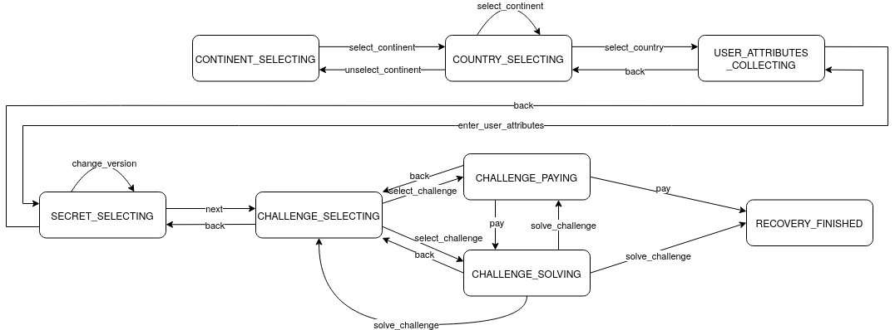

..
  This file is part of Anastasis
  Copyright (C) 2019-2021 Anastasis SARL

  Anastasis is free software; you can redistribute it and/or modify it under the
  terms of the GNU Affero General Public License as published by the Free Software
  Foundation; either version 2.1, or (at your option) any later version.

  Anastasis is distributed in the hope that it will be useful, but WITHOUT ANY
  WARRANTY; without even the implied warranty of MERCHANTABILITY or FITNESS FOR
  A PARTICULAR PURPOSE.  See the GNU Affero General Public License for more details.

  You should have received a copy of the GNU Affero General Public License along with
  Anastasis; see the file COPYING.  If not, see <http://www.gnu.org/licenses/>

  @author Christian Grothoff
  @author Dominik Meister
  @author Dennis Neufeld

-----------
Reducer API
-----------

This section describes the Anastasis Reducer API which is used by client applications
to store or load the different states the client application can have.
The reducer takes a state_ in JSON syntax and returns the new state in JSON syntax.

For example a **state** may take the following structure:

.. code-block:: json

    {
      "backup_state": "CONTINENT_SELECTING",
      "continents": [
        "Europe",
        "North_America"
      ]
    }

The new state depends on the previous one and on the transition action_ with its
arguments given to the reducer. A **transition argument** also is a statement in JSON syntax:

.. code-block:: json

    {
      "continent": "Europe"
    }

The new state returned by the reducer with the state and transition argument defined
above would look like following for the transition action_ ``select_continent``:

.. code-block:: json

  {
    "backup_state": "COUNTRY_SELECTING",
    "continents": [
      "Europe",
      "North_America"
    ],
    "selected_continent": "Europe",
    "countries": [
      {
        "code": "ch",
        "name": "Switzerland",
        "continent": "Europe",
        "name_i18n": {
          "de_DE": "Schweiz",
          "de_CH": "Schwiiz",
          "fr": "Suisse",
          "en": "Swiss"
        },
        "currency": "CHF"
      },
      {
        "code": "de",
        "name": "Germany",
        "continent": "Europe",
        "continent_i18n": {
          "de": "Europa"
        },
        "name_i18n": {
          "de_DE": "Deutschland",
          "de_CH": "Deutschland",
          "fr": "Allemagne",
          "en": "Germany"
        },
        "currency": "EUR"
      }
    ]
  }

An action may also result into an *error response* instead of a new state.
Clients should then render this error response to the user and allow the user
to continue from the old state.  An error response looks like this:

.. code-block:: json

  {
    "code": 123,
    "hint": "something went wrong",
    "details": "parameter foo failed to frobnify"
  }

States
^^^^^^

Overall, the reducer knows the following states:

  - **CONTINENT_SELECTING**: The user should specify the continent where they are living,
               so that we can show a list of countries to choose from.
  - **COUNTRY_SELECTING**: The user should specify the country where they are living,
               so that we can determine appropriate attributes, currencies and Anastasis
               providers.
  - **USER_ATTRIBUTES_COLLECTING**: The user should provide the country-specific personal
               attributes.
  - **AUTHENTICATIONS_EDITING**: The user should add authentication methods to be used
               during recovery.
  - **POLICIES_REVIEWING**: The user should review the recovery policies.
  - **SECRET_EDITING**: The user should edit the secret to be backed up.
  - **TRUTHS_PAYING**: The user needs to pay for one or more uploads of data associated
               with an authentication method.
  - **POLICIES_PAYING**: The user needs to pay for storing the recovery policy document.
  - **BACKUP_FINISHED**: A backup has been successfully generated.
  - **SECRET_SELECTING**: The user needs to select a recovery policy document with
               the secret that is to be recovered.
  - **CHALLENGE_SELECTING**: The user needs to select an authorization challenge to
               proceed with recovery.
  - **CHALLENGE_PAYING**: The user needs to pay to proceed with the authorization challenge.
  - **CHALLENGE_SOLVING**: The user needs to solve the authorization challenge.
  - **RECOVERY_FINISHED**: The secret of the user has been recovered.

State names:

  - In SELECTING-states, the user has to choose one value out of a predefined set of values (for example a continent out of a set of continents).
  - In COLLECTING-states, the user has to give certain values.
  - In EDITING-states, the user is free to choose which values he wants to give.
  - In REVEIWING-states, the user may make a few choices, but primarily is expected to affirm something.
  - in PAYING-states, the user must make a payment.
  - in FINISHED-states, the operation has definitively concluded.

Backup Reducer
^^^^^^^^^^^^^^
.. _state:
.. _action:

    Backup states and their transitions.

The illustration above shows the different states the reducer can have during a backup
process.

Recovery Reducer
^^^^^^^^^^^^^^^^

    Recovery states and their transitions.

The illustration above shows the different states the reducer can have during a recovery
process.

Reducer transitions
^^^^^^^^^^^^^^^^^^^
In the following, the individual transitions will be specified in more detail.
Note that we only show fields added by the reducer, typically the previous
state is preserved to enable "back" transitions to function smoothly.

Initial state
-------------

The initial states for backup and recovery processes are:

**Initial backup state:**

.. code-block:: json

    {
      "backup_state": "CONTINENT_SELECTING",
      "continents": [
        "Europe",
        "North America"
      ]
    }

**Initial recovery state:**

.. code-block:: json

    {
      "recovery_state": "CONTINENT_SELECTING",
      "continents": [
        "Europe",
        "North America"
      ]
    }

Here, "continents" is an array of English strings with the names of the
continents which contain countries for which Anastasis could function (based
on having providers that are known to operate and rules being provided for
user attributes from those countries).

For internationalization, another field ``continents_i18n`` may be present.
This field would be a map of language names to arrays of translated
continent names:

.. code-block:: json

    {
      "recovery_state": "CONTINENT_SELECTING",
      "continents": [
        "Europe",
        "North America"
      ]
      "continents_i18n":
      {
        "de_DE" : [
          "Europa",
          "Nordamerika"
          ],
        "de_CH" : [
          "Europa",
          "Nordamerika"
          ]
      }
    }

Translations must be given in the same order as the main English array.

Common transitions
------------------

**select_continent:**

Here the user specifies the continent they live on.  Arguments (example):

.. code-block:: json

    {
      "continent": "Europe"
    }

The continent must be given using the English name from the ``continents`` array.
Using a translated continent name is invalid and may result in failure.

The reducer returns an updated state with a list of countries to choose from,
for example:

.. code-block:: json

    {
      "backup_state": "COUNTRY_SELECTING",
      "selected_continent": "Europe",
      "countries": [
        {
          "code": "ch",
          "name": "Switzerland",
          "continent": "Europe",
          "name_i18n": {
            "de_DE": "Schweiz",
            "de_CH": "Schwiiz",
            "fr": "Suisse",
            "en": "Swiss"
          },
          "currency": "CHF"
        },
        {
          "code": "de",
          "name": "Germany",
          "continent": "Europe",
          "continent_i18n": {
            "de": "Europa"
          },
          "name_i18n": {
            "de_DE": "Deutschland",
            "de_CH": "Deutschland",
            "fr": "Allemagne",
            "en": "Germany"
          },
          "currency": "EUR"
        }
      ]
    }

Here ``countries`` is an array of countries on the ``selected_continent``.  For
each country, the ``code`` is the ISO 3166-1 alpha-2 country code.  The
``continent`` is only present because some countries span continents, the
information is redundant and will always match ``selected_continent``.  The
``name`` is the name of the country in English, internationalizations of the
name may be provided in ``name_i18n``.  The ``currency`` is **an** official
currency of the country, if a country has multiple currencies, it may appear
multiple times in the list.  In this case, the user should select the entry
with the currency they intend to pay with.  It is also possible for users
to select a currency that does not match their country, but user interfaces
should by default try to use currencies that match the user's residence.

**select_country:**

Selects the country (via the country code) and specifies the currency.
The latter is needed as some countries have more than one currency,
and some use-cases may also involve users insisting on paying with
foreign currency.

Arguments (example):

.. code-block:: json

    {
      "country_code": "de",
      "currency": "EUR"
    }

The ``country_code`` must be an ISO 3166-1 alpha-2 country code from
the array of ``countries`` of the reducer's state.  The ``currency``
field must be a valid currency accepted by the Taler payment system.

The reducer returns a new state with the list of attributes the
user is expected to provide, as well as possible authentication
providers that accept payments in the selected currency:

.. code-block:: json

    {
      "backup_state": "USER_ATTRIBUTES_COLLECTING",
      "selected_country": "de",
      "currency": "EUR",
      "required_attributes": [
        {
          "type": "string",
          "name": "full_name",
          "label": "Full name",
          "label_i18n": {
            "de_DE": "Vollstaendiger Name",
            "de_CH": "Vollstaendiger. Name",
            "fr": "Nom complet",
            "en": "Full name"
          },
          "widget": "anastasis_gtk_ia_full_name",
          "uuid" : "9e8f463f-575f-42cb-85f3-759559997331"
        },
        {
          "type": "date",
          "name": "birthdate",
          "label": "Birthdate",
          "label_i18n": {
            "de_DE": "Geburtsdatum",
            "de_CH": "Geburtsdatum",
            "fr": "Date de naissance",
            "en": "Birthdate"
          },
          "uuid" : "83d655c7-bdb6-484d-904e-80c1058c8854"
          "widget": "anastasis_gtk_ia_birthdate"
        },
 	    {
	       "type": "string",
               "name": "tax_number",
	       "label": "Taxpayer identification number",
	       "label_i18n":{
		     "de_DE": "Steuerliche Identifikationsnummer",
	  	     "de_CH": "Steuerliche Identifikationsnummer",
	   	     "en": "German taxpayer identification number"
	       },
	       "widget": "anastasis_gtk_ia_tax_de",
               "uuid": "dae48f85-e3ff-47a4-a4a3-ed981ed8c3c6",
	       "validation-regex": "^[0-9]{11}$",
	       "validation-logic": "DE_TIN_check"
   	    },
        {
          "type": "string",
          "name": "social_security_number",
          "label": "Social security number",
          "label_i18n": {
            "de_DE": "Sozialversicherungsnummer",
            "de_CH": "Sozialversicherungsnummer",
            "fr": "Numéro de sécurité sociale",
            "en": "Social security number"
          },
          "widget": "anastasis_gtk_ia_ssn",
   	  "validation-regex": "^[0-9]{8}[[:upper:]][0-9]{3}$",
	  "validation-logic": "DE_SVN_check"
          "optional" : true
      }
      ],
      "authentication_providers": {
        "http://localhost:8089/": {
          "http_status": 200,
          "methods": [
            { "type" : "question",
              "usage_fee" : "EUR:0.0" },
            { "type" : "sms",
              "usage_fee" : "EUR:0.5" }
          ],
          "annual_fee": "EUR:4.99",
          "truth_upload_fee": "EUR:4.99",
          "liability_limit": "EUR:1",
          "currency": "EUR",
          "truth_lifetime": { "d_ms" : 50000000 },
          "storage_limit_in_megabytes": 1,
          "provider_name": "Anastasis 4",
          "salt": "CXAPCKSH9D3MYJTS9536RHJHCW"
        },
        "http://localhost:8088/": {
          "http_status": 200,
          "methods": [
            { "type" : "question",
              "usage_fee" : "EUR:0.01" },
            { "type" : "sms",
              "usage_fee" : "EUR:0.55" }
          ],
          "annual_fee": "EUR:0.99",
          "truth_upload_fee": "EUR:3.99",
          "liability_limit": "EUR:1",
          "currency": "EUR",
          "truth_lifetime": { "d_ms" : 50000000 },
          "storage_limit_in_megabytes": 1,
          "provider_name": "Anastasis 4",
          "salt": "CXAPCKSH9D3MYJTS9536RHJHCW"
        }
      }
    }

The array of ``required_attributes`` contains attributes about the user
that must be provided includes:

  - **type**: The type of the attribute, for now only ``string`` and ``date`` are
    supported.
  - **name**: The name of the attribute, this is the key under which the
    attribute value must be provided later. The name must be unique per response.
  - **label**: A human-readable description of the attribute in English.
    Translated descriptions may be provided under **label_i18n**.
  - **uuid**: A UUID that uniquely identifies identical attributes across
    different countries. Useful to preserve values should the user enter
    some attributes, and then switch to another country.  Note that
    attributes must not be preserved if they merely have the same **name**,
    only the **uuid** will be identical if the semantics is identical.
  - **widget**: An optional name of a widget that is known to nicely render
    the attribute entry in user interfaces where named widgets are
    supported.
  - **validation-regex**: An optional extended POSIX regular expression
    that is to be used to validate (string) inputs to ensure they are
    well-formed.
  - **validation-logic**: Optional name of a function that should be called
    to validate the input.  If the function is not known to the particular
    client, the respective validation can be skipped (at the expense of
    typos by users not being detected, possibly rendering secrets
    irrecoverable).
  - **optional**: Optional boolean field that, if ``true``, indicates that
    this attribute is not actually required but optional and users MAY leave
    it blank in case they do not have the requested information. Used for
    common fields that apply to some large part of the population but are
    not sufficiently universal to be actually required.

The authentication providers are listed under a key that is the
base URL of the service. For each provider, the following
information is provided if the provider was successfully contacted:

  - **http_status**: HTTP status code, always ``200`` on success.
  - **methods**: Array of authentication methods supported by this
    provider. Includes the **type** of the authentication method
    and the **usage_fee** (how much the user must pay for authorization
    using this method during recovery).
  - **annual_fee**: Fee the provider charges to store the recovery
    policy for one year.
  - **truth_upload_fee**: Fee the provider charges to store a key share.
  - **liability_limit**: Amount the provider can be held liable for in
    case a key share or recovery document cannot be recovered due to
    provider failures.
  - **currency**: Currency in which the provider wants to be paid,
    will match all of the fees.
  - **storage_limit_in_megabytes**: Maximum size of an upload (for
    both recovery document and truth data) in megabytes.
  - **provider_name**: Human-readable name of the provider's business.
  - **salt**: Salt value used by the provider, used to derive the
    user's identity at this provider. Should be unique per provider,
    and must never change for a given provider.  The salt is
    base32 encoded.

If contacting the provider failed, the information returned is:

  - **http_status**: HTTP status code (if available, possibly 0 if
    we did not even obtain an HTTP response).
  - **error_code**: Taler error code, never 0.

**add_provider**:

This operation can be performed in state ``USER_ATTRIBUTES_COLLECTING``.  It
adds one or more Anastasis providers to the list of providers the reducer
should henceforth consider.  Note that removing providers is not possible at
this time.

Here, the client must provide an object with the base URLs of the
providers to add or disable. The object maps the
URLs to status information about the provider to
use. For example:

.. code-block:: json

    {
      "http://localhost:8088/" : { "disabled" : false },
      "http://localhost:8089/" : { "disabled" : false }
      "http://localhost:8090/" : { "disabled" : true },
    }

Note that existing providers will remain in the state they were in.  The following is an
example for an expected new state where the service on port 8089 is
unreachable, the services on port 8088 and 8888 were previously known, and service on
port 8088 was now added, and on 8090 is disabled:

.. code-block:: json

    {
      "backup_state": "USER_ATTRIBUTES_COLLECTING",
      "authentication_providers": {
        "http://localhost:8089/": {
          "disabled": false,
          "error_code": 11,
          "http_status": 0
        },
        "http://localhost:8090/": {
          "disabled": true
        },
        "http://localhost:8088/": {
          "disabled": false,
          "http_status": 200,
          "methods": [
            { "type" : "question",
              "usage_fee" : "EUR:0.01" },
            { "type" : "sms",
              "usage_fee" : "EUR:0.55" }
          ],
          "annual_fee": "EUR:0.99",
          "truth_upload_fee": "EUR:3.99",
          "liability_limit": "EUR:1",
          "currency": "EUR",
          "truth_lifetime": { "d_ms" : 50000000 },
          "storage_limit_in_megabytes": 1,
          "provider_name": "Anastasis 4",
          "salt": "CXAPCKSH9D3MYJTS9536RHJHCW"
        }
        "http://localhost:8888/": {
          "methods": [
            { "type" : "question",
              "usage_fee" : "EUR:0.01" },
            { "type" : "sms",
              "usage_fee" : "EUR:0.55" }
          ],
          "annual_fee": "EUR:0.99",
          "truth_upload_fee": "EUR:3.99",
          "liability_limit": "EUR:1",
          "currency": "EUR",
          "truth_lifetime": { "d_ms" : 50000000 },
          "storage_limit_in_megabytes": 1,
          "provider_name": "Anastasis 42",
          "salt": "BXAPCKSH9D3MYJTS9536RHJHCX"
        }
      }
    }

Backup transitions
------------------

**enter_user_attributes:**

This transition provides the user's personal attributes. The specific set of
attributes required depends on the country of residence of the user.  Some
attributes may be optional, in which case they should be omitted entirely
(that is, not simply be set to ``null`` or an empty string).  Example
arguments would be:

.. code-block:: json

    {
      "identity_attributes": {
        "full_name": "Max Musterman",
        "social_security_number": "123456789",
        "birthdate": "2000-01-01",
        "birthplace": "Earth"
     }
    }

Note that at this stage, the state machines between backup and
recovery diverge and the ``recovery_state`` will begin to look
very different from the ``backup_state``.

For backups, if all required attributes are present, the reducer will
transition to an ``AUTHENTICATIONS_EDITING`` state with the attributes added
to it:

.. code-block:: json

    {
      "backup_state": "AUTHENTICATIONS_EDITING",
      "identity_attributes": {
        "full_name": "Max Musterman",
        "social_security_number": "123456789",
        "birthdate": "2000-01-01",
        "birthplace": "Earth"
      }
    }

If required attributes are missing, do not match the required regular
expression, or fail the custom validation logic, the reducer SHOULD return an
error response indicating that the transition has failed and what is wrong about
the input and not transition to a new state.  A reducer that does not support
some specific validation logic MAY accept the invalid input and proceed anyway.
The error state will include a Taler error code that is specific to the
failure, and optional details.

Example:

.. code-block:: json

    {
      "code": 8404,
      "hint": "An input did not match the regular expression.",
      "detail": "social_security_number"
    }

Clients may safely repeat this transition to validate the user's inputs
until they satisfy all of the constraints.  This way, the user interface
does not have to perform the input validation directly.

**add_authentication**:

This transition adds an authentication method.  The method must be supported
by one or more providers that are included in the current state.  Adding an
authentication method requires specifying the ``type`` and ``instructions`` to
be given to the user.  The ``challenge`` is encrypted and stored at the
Anastasis provider. The specific semantics of the value depend on the
``type``.  Typical challenges values are a phone number (to send an SMS to),
an e-mail address (to send a PIN code to) or the answer to a security
question.  Note that these challenge values will still be encrypted (and
possibly hashed) before being given to the Anastasis providers.

Note that the ``challenge`` must be given in Crockford Base32 encoding, as it
MAY include binary data (such as a photograph of the user).  In the latter
case, the optional ``mime_type`` field must be provided to give the MIME type
of the value encoded in ``challenge``.

.. code-block:: json

    {
      "authentication_method":
      {
        "type": "question",
        "mime_type" : "text/plain",
        "instructions" : "What is your favorite GNU package?",
        "challenge" : "E1QPPS8A",
      }
    }

If the information provided is valid, the reducer will add the new
authentication method to the array of authentication methods:

.. code-block:: json

    {
      "backup_state": "AUTHENTICATIONS_EDITING",
      "authentication_methods": [
        {
          "type": "question",
          "mime_type" : "text/plain",
          "instructions" : "What is your favorite GNU package?",
          "challenge" : "E1QPPS8A",
        },
        {
          "type": "email",
          "instructions" : "E-mail to user@*le.com",
          "challenge": "ENSPAWJ0CNW62VBGDHJJWRVFDM50"
        }
      ]
    }

**delete_authentication**:

This transition can be used to remove an authentication method from the
array of authentication methods. It simply requires the index of the
authentication method to remove. Note that the array is 0-indexed:

.. code-block:: json

    {
      "authentication_method": 1
    }

Assuming we begin with the state from the example above, this would
remove the ``email`` authentication method, resulting in the following
response:

.. code-block:: json

    {
      "backup_state": "AUTHENTICATIONS_EDITING",
      "authentication_methods": [
        {
          "type": "question",
          "mime_type" : "text/plain",
          "instructions" : "What is your favorite GNU package?",
          "challenge" : "gdb",
        }
      ]
    }

If the index is invalid, the reducer will return an error
response instead of making a transition.

**next** (from ``AUTHENTICATIONS_EDITING``):

This transition confirms that the user has finished adding (or removing)
authentication methods, and that the system should now automatically compute
a set of reasonable recovery policies.

This transition does not take any mandatory arguments.  Optional arguments can
be provided to upload the recovery document only to a specific subset of the
providers:

.. code-block:: json

    {
      "providers": [
        "http://localhost:8088/",
        "http://localhost:8089/"
      ]
    }

The resulting state provides the suggested recovery policies in a way suitable
for presentation to the user:

.. code-block:: javascript

    {
      "backup_state": "POLICIES_REVIEWING",
      "policy_providers" : [
          { "provider_url" : "http://localhost:8088/" },
          { "provider_url" : "http://localhost:8089/" }
      ],
      "policies": [
        {
          "methods": [
            {
              "authentication_method": 0,
              "provider": "http://localhost:8088/"
            },
            {
              "authentication_method": 1,
              "provider": "http://localhost:8089/"
            },
            {
              "authentication_method": 2,
              "provider": "http://localhost:8087/"
            }
          ]
        },
        {
          "methods": [
            {
              "authentication_method": 0,
              "provider": "http://localhost:8088/"
            },
            {
              "authentication_method": 1,
              "provider": "http://localhost:8089/"
            },
            {
              "authentication_method": 3,
              "provider": "http://localhost:8089/"
            }
          ]
        }
      ]
    }

For each recovery policy, the state includes the specific details of which
authentication ``methods`` must be solved to recovery the secret using this
policy.  The ``methods`` array specifies the index of the
``authentication_method`` in the ``authentication_methods`` array, as well as
the provider that was selected to supervise this authentication.

If no authentication method was provided, the reducer will
return an error response instead of making a transition.

**add_policy**:

Using this transition, the user can add an additional recovery policy to the
state.  The argument format is the same that is used in the existing state.
An example for a possible argument would thus be:

.. code-block:: javascript

    {
      "policy": [
        {
          "authentication_method": 1,
          "provider": "http://localhost:8088/"
        },
        {
          "authentication_method": 3,
          "provider": "http://localhost:8089/"
        }
      ]
    }

Note that the specified providers must already be in the
``authentication_providers`` of the state. You cannot add new providers at
this stage.  The reducer will simply attempt to append the suggested policy to
the "policies" array, returning an updated state:

.. code-block:: json

    {
      "backup_state": "POLICIES_REVIEWING",
      "policies": [
        {
          "methods": [
            {
              "authentication_method": 0,
              "provider": "http://localhost:8089/"
            },
            {
              "authentication_method": 1,
              "provider": "http://localhost:8088/"
            }
          ]
        },
        {
          "methods": [
            {
              "authentication_method": 0,
              "provider": "http://localhost:8089/"
            },
            {
              "authentication_method": 2,
              "provider": "http://localhost:8088/"
            }
          ]
        },
        {
          "methods": [
            {
              "authentication_method": 1,
              "provider": "http://localhost:8089/"
            },
            {
              "authentication_method": 2,
              "provider": "http://localhost:8088/"
            }
          ]
        },
        {
          "methods": [
            {
              "authentication_method": 1,
              "provider": "http://localhost:8088/"
            },
            {
              "authentication_method": 3,
              "provider": "http://localhost:8089/"
            }
          ]
        }
      ]
    }

If the new policy is invalid, for example because it adds an unknown
authentication method, or the selected provider does not support the type of
authentication, the reducer return an error response instead of
adding the new policy.

**update_policy**:

Using this transition, the user can modify an existing recovery policy
in the state.
The argument format is the same that is used in **add_policy**,
except there is an additional key ``policy_index`` which
identifies the policy to modify.
An example for a possible argument would thus be:

.. code-block:: javascript

    {
      "policy_index" : 1,
      "policy": [
        {
          "authentication_method": 1,
          "provider": "http://localhost:8088/"
        },
        {
          "authentication_method": 3,
          "provider": "http://localhost:8089/"
        }
      ]
    }

If the new policy is invalid, for example because it adds an unknown
authentication method, or the selected provider does not support the type of
authentication, the reducer will return an error response instead of
modifying the policy.

**delete_policy:**

This transition allows the deletion of a recovery policy. The argument
simply specifies the index of the policy to delete, for example:

.. code-block:: json

    {
      "policy_index": 3
    }

Given as input the state from the example above, the expected new state would
be:

.. code-block:: json

    {
      "backup_state": "POLICIES_REVIEWING",
      "policies": [
        {
          "methods": [
            {
              "authentication_method": 0,
              "provider": "http://localhost:8089/"
            },
            {
              "authentication_method": 1,
              "provider": "http://localhost:8088/"
            }
          ]
        },
        {
          "methods": [
            {
              "authentication_method": 0,
              "provider": "http://localhost:8089/"
            },
            {
              "authentication_method": 2,
              "provider": "http://localhost:8088/"
            }
          ]
        },
        {
          "methods": [
            {
              "authentication_method": 1,
              "provider": "http://localhost:8089/"
            },
            {
              "authentication_method": 2,
              "provider": "http://localhost:8088/"
            }
          ]
        }
      ]
    }

If the index given is invalid, the reducer will return an error response
instead of deleting a policy.

**delete_challenge:**

This transition allows the deletion of an individual
challenge from a recovery policy. The argument
simply specifies the index of the policy and challenge
to delete, for example:

.. code-block:: json

    {
      "policy_index": 1,
      "challenge_index" : 1
    }

Given as input the state from the example above, the expected new state would
be:

.. code-block:: json

    {
      "backup_state": "POLICIES_REVIEWING",
      "policies": [
        {
          "methods": [
            {
              "authentication_method": 0,
              "provider": "http://localhost:8089/"
            },
            {
              "authentication_method": 1,
              "provider": "http://localhost:8088/"
            }
          ]
        },
        {
          "methods": [
            {
              "authentication_method": 0,
              "provider": "http://localhost:8089/"
            }
          ]
        },
        {
          "methods": [
            {
              "authentication_method": 1,
              "provider": "http://localhost:8089/"
            },
            {
              "authentication_method": 2,
              "provider": "http://localhost:8088/"
            }
          ]
        }
      ]
    }

If the index given is invalid, the reducer will return an error response
instead of deleting a challenge.

**next** (from ``POLICIES_REVIEWING``):

Using this transition, the user confirms that the policies in the current
state are acceptable. The transition does not take any arguments.

The reducer will simply transition to the ``SECRET_EDITING`` state:

.. code-block:: json

    {
      "backup_state": "SECRET_EDITING",
      "upload_fees" : [ { "fee": "KUDOS:42" } ],
      "expiration" : { "t_ms" : 1245362362 }
    }

Here, ``upload_fees`` is an array of applicable upload fees for the
given policy expiration time. This is an array because fees could
be in different currencies.  The final cost may be lower if the
user already paid for some of the time.

If the array of ``policies`` is currently empty, the reducer will
return an error response instead of allowing the user to continue.

**enter_secret:**

This transition provides the reducer with the actual core ``secret`` of the user
that Anastasis is supposed to backup (and possibly recover). The argument is
simply the Crockford-Base32 encoded ``value`` together with its ``mime`` type, or a ``text`` field with a human-readable secret text.
For example:

.. code-block:: javascript

    {
      "secret": {
         "value": "EDJP6WK5EG50",
         "mime" : "text/plain"
      },
      "expiration" : { "t_ms" : 1245362362 }
    }

If the application is unaware of the format, it set the ``mime`` field to ``null``.
The ``expiration`` field is optional.

The reducer remains in the ``SECRET_EDITING`` state, but now the secret and
updated expiration time are part of the state and the cost calculations will
be updated.

.. code-block:: json

    {
      "backup_state": "SECRET_EDITING",
      "core_secret" : {
         "value": "EDJP6WK5EG50",
         "mime" : "text/plain"
      },
      "expiration" : { "t_ms" : 1245362362 },
      "upload_fees" : [ { "fee": "KUDOS:42" } ]
    }

**clear_secret:**

This transition removes the core secret from the state.  It is simply a
convenience function to undo ``enter_secret`` without providing a new value
immediately. The transition takes no arguments.  The resuting state will no
longer have the ``core_secret`` field, and be otherwise unchanged. Calling
**clear_secret** on a state without a ``core_secret`` will result in an error.

**enter_secret_name:**

This transition provides the reducer with a name for the core ``secret`` of the user. This name will be given to the user as a hint when seleting a recovery policy document during recovery, prior to satisfying any of the challenges. The argument simply contains the name for the secret.
Applications that have built-in support for Anastasis MUST prefix the
secret name with an underscore and an application-specific identifier
registered in GANA so that they can use recognize their own backups.
An example argument would be:

.. code-block:: javascript

    {
      "name": "_TALERWALLET_MyPinePhone",
    }

Here, ``MyPinePhone`` might be chosen by the user to identify the
device that was being backed up.

The reducer remains in the ``SECRET_EDITING`` state, but now the
secret name is updated:

.. code-block:: json

    {
      "secret_name" : "_TALERWALLET_MyPinePhone"
    }

**update_expiration:**

This transition asks the reducer to change the desired expiration time
and to update the associated cost. For example:

.. code-block:: javascript

    {
      "expiration" : { "t_ms" : 1245362362 }
    }

The reducer remains in the ``SECRET_EDITING`` state, but the
expiration time and cost calculation will be updated.

.. code-block:: json

    {
      "backup_state": "SECRET_EDITING",
      "expiration" : { "t_ms" : 1245362362 },
      "upload_fees" : [ { "fee": "KUDOS:43" } ]
    }

**next** (from ``SECRET_EDITING``):

Using this transition, the user confirms that the secret and expiration
settings in the current state are acceptable. The transition does not take any
arguments.

If the secret is currently empty, the reducer will return an
error response instead of allowing the user to continue.

After adding a secret, the reducer may transition into different states
depending on whether payment(s) are necessary.  If payments are needed, the
``secret`` will be stored in the state under ``core_secret``.  Applications
should be careful when persisting the resulting state, as the ``core_secret``
is not protected in the ``PAYING`` states.  The ``PAYING`` states only differ
in terms of what the payments are for (key shares or the recovery document),
in all cases the state simply includes an array of Taler URIs that refer to
payments that need to be made with the Taler wallet.

If all payments are complete, the reducer will transition into the
``BACKUP_FINISHED`` state and (if applicable) delete the ``core_secret`` as an
additional safety measure.

Example results are thus:

.. code-block:: json

    {
      "backup_state": "TRUTHS_PAYING",
      "secret_name" : "$NAME",
      "core_secret" : { "$anything":"$anything" },
      "payments": [
        "taler://pay/...",
        "taler://pay/..."
      ]
    }

.. code-block:: json

    {
      "backup_state": "POLICIES_PAYING",
      "secret_name" : "$NAME",
      "core_secret" : { "$anything":"$anything" },
      "payments": [
        "taler://pay/...",
        "taler://pay/..."
      ]
    }

.. code-block:: json

    {
      "backup_state": "BACKUP_FINISHED",
      "success_details": {
        "http://localhost:8080/" : {
          "policy_version" : 1,
          "policy_expiration" : { "t_ms" : 1245362362000 }
        },
        "http://localhost:8081/" : {
          "policy_version" : 3,
          "policy_expiration" : { "t_ms" : 1245362362000 }
        }
      }
    }

**pay:**

This transition suggests to the reducer that a payment may have been made or
is immanent, and that the reducer should check with the Anastasis service
provider to see if the operation is now possible.  The operation takes one
optional argument, which is a ``timeout`` value that specifies how long the
reducer may wait (in long polling) for the payment to complete:

.. code-block:: json

    {
      "timeout":  { "d_ms" : 5000 },
    }

The specified timeout is passed on to the Anastasis service provider(s), which
will wait this long before giving up.  If no timeout is given, the check is
done as quickly as possible without additional delays.  The reducer will continue
to either an updated state with the remaining payment requests, to the
``BACKUP_FINISHED`` state (if all payments have been completed and the backup
finished), or return an error response in case there was an irrecoverable error,
indicating the specific provider and how it failed.  An example for this
final error state would be:

.. code-block:: json

    {
      "http_status" : 500,
      "upload_status" : 52,
      "provider_url" : "https://bad.example.com/",
    }

Here, the fields have the following meaning:

  - **http_status** is the HTTP status returned by the Anastasis provider.
  - **upload_status** is the Taler error code return by the provider.
  - **provider_url** is the base URL of the failing provider.

In the above example, 52 would thus imply that the Anastasis provider failed to
store information into its database.

Recovery transitions
--------------------

**enter_user_attributes:**

This transition provides the user's personal attributes. The specific set of
attributes required depends on the country of residence of the user.  Some
attributes may be optional, in which case they should be omitted entirely
(that is, not simply be set to ``null`` or an empty string).  The
arguments are identical to the **enter_user_attributes** transition from
the backup process.  Example arguments would thus be:

.. code-block:: json

    {
      "identity_attributes": {
        "full_name": "Max Musterman",
        "social_security_number": "123456789",
        "birthdate": "2000-01-01",
        "birthplace": "Earth"
      }
    }

However, in contrast to the backup process, the reducer will attempt to
retrieve the latest recovery document from all known providers for the
selected currency given the above inputs.  If a recovery document was found
by any provider, the reducer will attempt to load it and transition to
a state where the user can choose which challenges to satisfy:

.. code-block:: json

    {
      "recovery_state": "CHALLENGE_SELECTING",
      "recovery_information": {
        "challenges": [
          {
            "uuid": "MW2R3RCBZPHNC78AW8AKWRCHF9KV3Y82EN62T831ZP54S3K5599G",
            "uuid-display": "MW2R3RC",
            "cost": "TESTKUDOS:0",
            "type": "question",
            "instructions": "q1"
          },
          {
            "uuid": "TXYKGE1SJZHJ4M2FKSV1P2RZVNTHZFB9E3A79QE956D3SCAWXPK0",
            "uuid-display": "TXYKGE",
            "cost": "TESTKUDOS:0",
            "type": "email",
            "instructions": "e-mail address m?il@f*.bar"
          },
        ],
        "policies": [
          [
            {
              "uuid": "MW2R3RCBZPHNC78AW8AKWRCHF9KV3Y82EN62T831ZP54S3K5599G"
            },
            {
              "uuid": "TXYKGE1SJZHJ4M2FKSV1P2RZVNTHZFB9E3A79QE956D3SCAWXPK0"
            },
          ],
        ],
        "provider_url": "http://localhost:8088/",
        "version": 1,
      },
      "recovery_document": {
        "...": "..."
      }
    }

The ``recovery_document`` is an internal representation of the recovery
information and of no concern to the user interface. The pertinent information
is in the ``recovery_information``. Here, the ``challenges`` array is a list
of possible challenges the user could attempt to solve next, while ``policies``
is an array of policies, with each policy being an array of challenges.
Satisfying all of the challenges of one of the policies will enable the secret
to be recovered.  The ``provider_url`` from where the recovery document was
obtained and its ``version`` are also provided.  Each challenge comes with
four mandatory fields:

    - **uuid**: A unique identifier of the challenge; this is what the
      UUIDs in the policies array refer to.
    - **uuid-display**: Shortened idenfier which is included in messages
      send to the user.  Allows the user to
      distinguish different PIN/TANs should say the same phone number be
      used for SMS-authentication with different providers.
    - **cost**: This is the amount the Anastasis provider will charge
      to allow the user to pass the challenge.
    - **type**: This is the type of the challenge, as a string.
    - **instructions**: Contains additional important hints for the user
      to allow the user to satisfy the challenge.  It typically includes
      an abbreviated form of the contact information or the security
      question. Details depend on ``type``.

If a recovery document was not found, either the user never performed
a backup, entered incorrect attributes, or used a provider not yet in
the list of Anastasis providers.  Hence, the user must now either
select a different provider, or go ``back`` and update the identity
attributes.  In the case a recovery document was not found, the
transition fails, returning the error code and a human-readable error
message together with a transition failure:

.. code-block:: json

    {
      "error_message": "account unknown to Anastasis server",
      "error_code": 9,
    }

Here, the ``error_code`` is from the ``enum ANASTASIS_RecoveryStatus``
and describes precisely what failed about the download, while the
``error_message`` is a human-readable (English) explanation of the code.
Applications may want to translate the message using GNU gettext;
translations should be available in the ``anastasis`` text domain.
However, in general it should be sufficient to display the slightly
more generic Taler error code that is returned with the new state.

**change_version:**

Even if a recovery document was found, it is possible that the user
intended to recover a different version, or recover a backup where
the recovery document is stored at a different provider. Thus, the
reducer allows the user to explicitly switch to a different provider
or recovery document version using the ``change_version`` transition,
which takes a provider URL and policy version as arguments:

.. code-block:: json

    {
      "provider_url": "https://localhost:8080/",
      "version": 2
    }

Note that using a version of 0 implies fetching "the latest version".  The
resulting states are the same as those of the ``enter_user_attributes``
transition, except that the recovery document version is not necessarily the
latest available version at the provider.

**select_challenge:**

Selecting a challenge takes different, depending on the state of the payment.
A comprehensive example for ``select_challenge`` would be:

.. code-block:: json

    {
        "uuid": "80H646H5ZBR453C02Y5RT55VQSJZGM5REWFXVY0SWXY1TNE8CT30"
        "timeout" : { "d_ms" : 5000 },
        "payment_secret": "3P4561HAMHRRYEYD6CM6J7TS5VTD5SR2K2EXJDZEFSX92XKHR4KG"
    }

The ``uuid`` field is mandatory and specifies the selected challenge.
The other fields are optional, and are needed in case the user has
previously been requested to pay for the challenge.  In this case,
the ``payment_secret`` identifies the previous payment request, and
``timeout`` says how long the Anastasis service should wait for the
payment to be completed before giving up (long polling).

Depending on the type of the challenge and the need for payment, the
reducer may transition into ``CHALLENGE_SOLVING`` or ``CHALLENGE_PAYING``
states.  In ``CHALLENGE_SOLVING``, the new state will primarily specify
the selected challenge:

.. code-block:: json

    {
      "backup_state": "CHALLENGE_SOLVING",
      "selected_challenge_uuid": "80H646H5ZBR453C02Y5RT55VQSJZGM5REWFXVY0SWXY1TNE8CT30"
    }

In ``CHALLENGE_PAYING``, the new state will include instructions for payment
in the ``challenge_feedback``. In general, ``challenge_feedback`` includes
information about attempted challenges, with the final state being ``solved``:

.. code-block:: json

    {
      "recovery_state": "CHALLENGE_SELECTING",
      "recovery_information": {
        "...": "..."
      }
      "challenge_feedback": {
        "80H646H5ZBR453C02Y5RT55VQSJZGM5REWFXVY0SWXY1TNE8CT30" : {
          "state" : "solved"
        }
      }
    }

Challenges feedback for a challenge can have many different ``state`` values
that applications must all handle. States other than ``solved`` are:

- **payment**: Here, the user must pay for a challenge. An example would be:

  .. code-block:: json

     {
       "backup_state": "CHALLENGE_PAYING",
       "selected_challenge_uuid": "80H646H5ZBR453C02Y5RT55VQSJZGM5REWFXVY0SWXY1TNE8CT30",
       "challenge_feedback": {
         "80H646H5ZBR453C02Y5RT55VQSJZGM5REWFXVY0SWXY1TNE8CT30" : {
          "state" : "payment",
          "taler_pay_uri" : "taler://pay/...",
          "provider" : "https://localhost:8080/",
          "payment_secret" : "3P4561HAMHRRYEYD6CM6J7TS5VTD5SR2K2EXJDZEFSX92XKHR4KG"
         }
       }
     }

- **body**: Here, the server provided an HTTP reply for
  how to solve the challenge, but the reducer could not parse
  them into a known format. A mime-type may be provided and may
  help parse the details.

  .. code-block:: json

     {
       "recovery_state": "CHALLENGE_SOLVING",
       "recovery_information": {
           "...": "..."
       }
       "selected_challenge_uuid": "TXYKGE1SJZHJ4M2FKSV1P2RZVNTHZFB9E3A79QE956D3SCAWXPK0",
       "challenge_feedback": {
         "TXYKGE1SJZHJ4M2FKSV1P2RZVNTHZFB9E3A79QE956D3SCAWXPK0": {
           "state": "body",
           "body": "CROCKFORDBASE32ENCODEDBODY",
           "http_status": 403,
           "mime_type" : "anything/possible"
         }
       }
     }

- **hint**: Here, the server provided human-readable hint for
  how to solve the challenge.  Note that the ``hint`` provided this
  time is from the Anastasis provider and may differ from the ``instructions``
  for the challenge under ``recovery_information``:

  .. code-block:: json

     {
       "recovery_state": "CHALLENGE_SOLVING",
       "recovery_information": {
           "...": "..."
       }
       "selected_challenge_uuid": "TXYKGE1SJZHJ4M2FKSV1P2RZVNTHZFB9E3A79QE956D3SCAWXPK0",
       "challenge_feedback": {
         "TXYKGE1SJZHJ4M2FKSV1P2RZVNTHZFB9E3A79QE956D3SCAWXPK0": {
           "state": "hint",
           "hint": "Recovery TAN send to email mail@DOMAIN",
           "http_status": 403
         }
       }
     }

- **details**: Here, the server provided a detailed JSON status response
  related to solving the challenge:

  .. code-block:: json

    {
      "recovery_state": "CHALLENGE_SOLVING",
      "recovery_information": {
         "...": "..."
      }
      "selected_challenge_uuid": "TXYKGE1SJZHJ4M2FKSV1P2RZVNTHZFB9E3A79QE956D3SCAWXPK0",
      "challenge_feedback": {
        "TXYKGE1SJZHJ4M2FKSV1P2RZVNTHZFB9E3A79QE956D3SCAWXPK0": {
          "state": "details",
          "details": {
            "code": 8111,
            "hint": "The client's response to the challenge was invalid.",
            "detail" : null
          },
          "http_status": 403
        }
      }
    }

- **redirect**: To solve the challenge, the user must visit the indicated
  Web site at ``redirect_url``, for example to perform video authentication:

  .. code-block:: json

     {
       "recovery_state": "CHALLENGE_SOLVING",
       "recovery_information": {
          "...": "..."
       }
       "selected_challenge_uuid": "TXYKGE1SJZHJ4M2FKSV1P2RZVNTHZFB9E3A79QE956D3SCAWXPK0",
       "challenge_feedback": {
         "TXYKGE1SJZHJ4M2FKSV1P2RZVNTHZFB9E3A79QE956D3SCAWXPK0": {
           "state": "redirect",
           "redirect_url": "https://videoconf.example.com/",
           "http_status": 303
         }
       }
     }

- **server-failure**: This indicates that the Anastasis provider encountered
  a failure and recovery using this challenge cannot proceed at this time.
  Examples for failures might be that the provider is unable to send SMS
  messages at this time due to an outage.  The body includes details about
  the failure. The user may try again later or continue with other challenges.

  .. code-block:: json

    {
      "recovery_state": "CHALLENGE_SELECTING",
      "recovery_information": {
          "...": "..."
      }
      "selected_challenge_uuid": "TXYKGE1SJZHJ4M2FKSV1P2RZVNTHZFB9E3A79QE956D3SCAWXPK0",
      "challenge_feedback": {
        "TXYKGE1SJZHJ4M2FKSV1P2RZVNTHZFB9E3A79QE956D3SCAWXPK0": {
         "state": "server-failure",
         "http_status": "500",
         "error_code": 52
       }
     }
   }

- **truth-unknown**: This indicates that the Anastasis provider is unaware of
  the specified challenge. This is typically a permanent failure, and user
  interfaces should not allow users to re-try this challenge.

  .. code-block:: json

    {
      "recovery_state": "CHALLENGE_SELECTING",
      "recovery_information": {
          "...": "..."
      }
      "selected_challenge_uuid": "TXYKGE1SJZHJ4M2FKSV1P2RZVNTHZFB9E3A79QE956D3SCAWXPK0",
      "challenge_feedback": {
        "TXYKGE1SJZHJ4M2FKSV1P2RZVNTHZFB9E3A79QE956D3SCAWXPK0": {
          "state": "truth-unknown",
          "error_code": 8108
        }
      }
    }

- **rate-limit-exceeded**: This indicates that the user has made too many invalid attempts in too short an amount of time.

  .. code-block:: json

     {
       "recovery_state": "CHALLENGE_SELECTING",
       "recovery_information": {
           "...": "..."
       }
       "selected_challenge_uuid": "TXYKGE1SJZHJ4M2FKSV1P2RZVNTHZFB9E3A79QE956D3SCAWXPK0",
       "challenge_feedback": {
         "TXYKGE1SJZHJ4M2FKSV1P2RZVNTHZFB9E3A79QE956D3SCAWXPK0": {
           "state": "rate-limit-exceeded",
           "error_code": 8121
         }
       }
     }

- **authentication-timeout**: This indicates that the challenge is awaiting for some external authentication process to complete. The application should ``poll`` for it to complete, or proceed with selecting other challenges.

  .. code-block:: json

     {
       "recovery_state": "CHALLENGE_SELECTING",
       "recovery_information": {
           "...": "..."
       }
       "selected_challenge_uuid": "TXYKGE1SJZHJ4M2FKSV1P2RZVNTHZFB9E3A79QE956D3SCAWXPK0",
       "challenge_feedback": {
         "TXYKGE1SJZHJ4M2FKSV1P2RZVNTHZFB9E3A79QE956D3SCAWXPK0": {
           "state": "authentication-timeout",
           "error_code": 8122
         }
       }
     }

- **external-instructions**: This indicates that the challenge requires the user to perform some authentication method-specific actions. Details about what the user should do are provided.

  .. code-block:: json

     {
       "recovery_state": "CHALLENGE_SELECTING",
       "recovery_information": {
           "...": "..."
       }
       "selected_challenge_uuid": "TXYKGE1SJZHJ4M2FKSV1P2RZVNTHZFB9E3A79QE956D3SCAWXPK0",
       "challenge_feedback": {
         "TXYKGE1SJZHJ4M2FKSV1P2RZVNTHZFB9E3A79QE956D3SCAWXPK0": {
           "state": "external-instructions",
           "method": "iban",
           "async": true, // optional
           "answer_code": 987654321, // optional
           "details": {
             "...": "..."
           }
         }
       }
     }

  If "async" is "true", then the client should
  poll for the challenge being satisfied using
  the "answer_code" that has been provided.

  The specific instructions on how to satisfy
  the challenge depend on the ``method``.
  They include:

  - **iban**: The user must perform a wire transfer from their account to the Anastasis provider.

    .. code-block:: json

      {
        "challenge_amount": "EUR:1",
        "credit_iban": "DE12345789000",
        "business_name": "Data Loss Incorporated",
        "wire_transfer_subject": "Anastasis 987654321"
      }

    Note that the actual wire transfer subject must contain both
    the numeric ``answer_code`` as well as
    the string ``Anastasis``.

**poll:**

With a ``poll`` transition, the application indicates that it wants to wait longer for one or more of the challenges that are in state ``authentication-timeout`` to possibly complete.  While technically optional, the ``timeout`` argument should really be provided to enable long-polling, for example:

.. code-block:: json

    {
        "timeout" : { "d_ms" : 5000 },
    }

**pay:**

With a ``pay`` transition, the application indicates to the reducer that
a payment may have been made. Here, it is again possible to specify an
optional ``timeout`` argument for long-polling, for example:

.. code-block:: json

    {
        "payment_secret": "ABCDADF242525AABASD52525235ABABFDABABANALASDAAKASDAS"
        "timeout" : { "d_ms" : 5000 },
    }

Depending on the type of the challenge and the result of the operation, the
new state may be ``CHALLENGE_SOLVING`` (if say the SMS was now sent to the
user), ``CHALLENGE_SELECTING`` (if the answer to the security question was
correct), ``RECOVERY_FINISHED`` (if this was the last challenge that needed to
be solved) or still ``CHALLENGE_PAYING`` (if the challenge was not actually
paid for).  For sample messages, see the different types of
``challenge_feedback`` in the section about ``select_challenge``.

**solve_challenge:**

Solving a challenge takes various formats, depending on the type of the
challenge and what is known about the answer.  The different supported
formats are:

.. code-block:: json

    {
        "answer": "answer to security question"
    }

.. code-block:: json

    {
        "pin": 1234
    }

.. code-block:: json

    {
        "hash": "SOMEBASE32ENCODEDHASHVALUE"
    }
